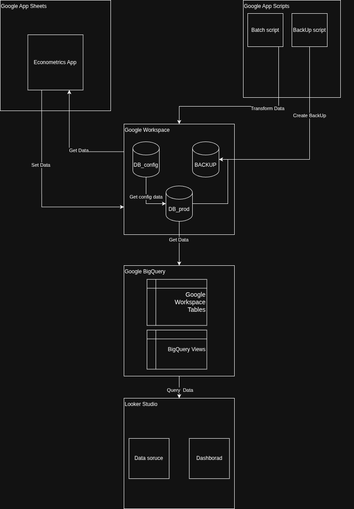
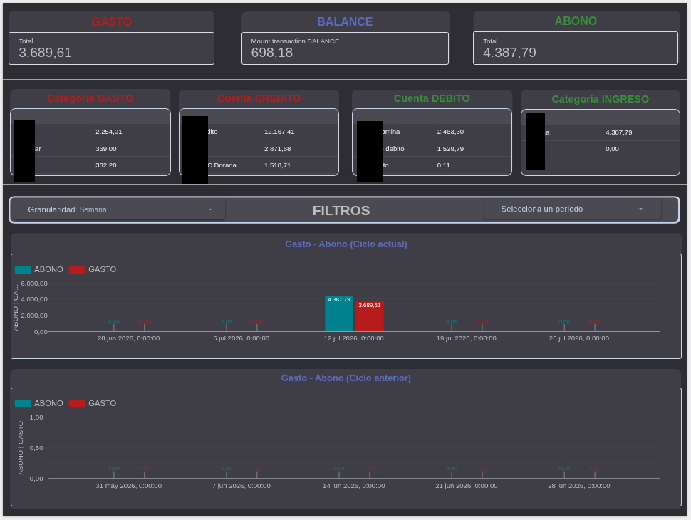
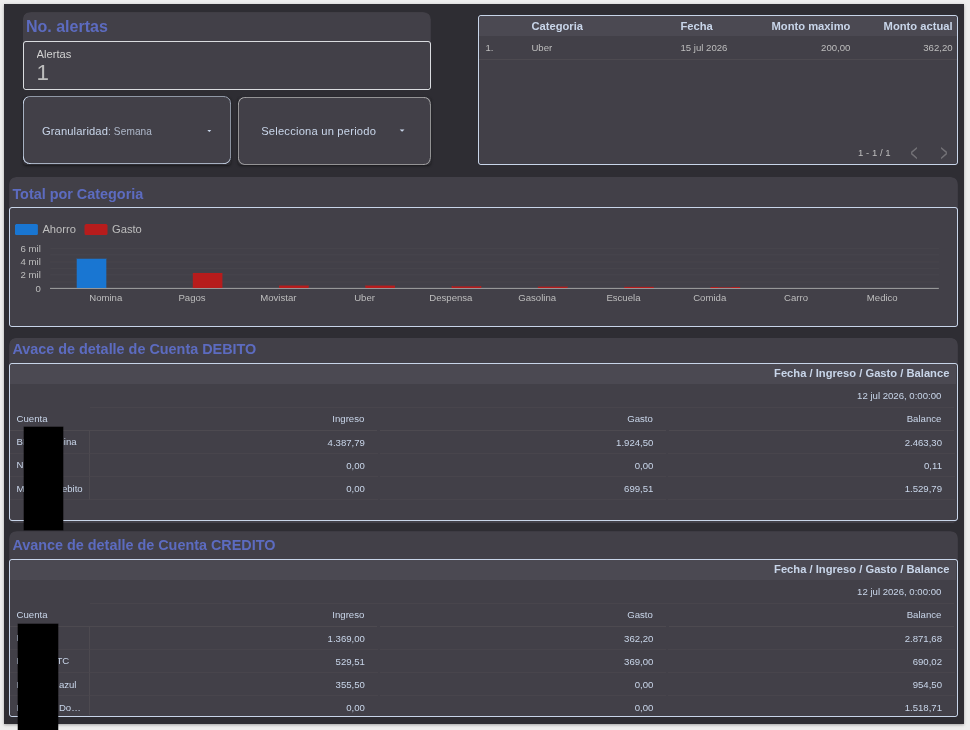

# Econometrics: Personal Financial Self-Management System

**Econometrics** is a comprehensive Business Intelligence (BI) and Data Engineering solution designed to keep exact control of a personal budget. The system covers the entire data lifecycle: from capture via a custom mobile application to transformation, cloud storage, and interactive visualization.

## 🎯 Project Objective
The main objective is to solve the problem of personal finance tracking through an automated ecosystem. It allows recording expenses and income in real-time through a user-friendly interface (App) and transforming that raw data into actionable knowledge via an analytical dashboard, facilitating budget control, the prevention of micro-expenses, and the analysis of accounting closes.

---

## 🏗️ Architecture and Data Flow
The project uses a modern architecture 100% based on the Google Cloud, optimized to be scalable and low-cost.

The information flow is divided into the following layers:

1. **Frontend / Data Entry (AppSheet):** Mobile interface ("Econometrics App") where the user enters their daily transactions.
2. **Storage (Google Workspace):** Operational database hosted on Google Sheets, logically separated into configuration tables (`DB_config`) and production data (`DB_prod`).
3. **Automation and ETL (Google Apps Script):** Scheduled scripts that transform the information.
   - *Batch Script:* Generates accounting closes and periodic transformations.
   - *Backup Script:* Creates automated security backups (`BACKUP`).
4. **Data Warehouse (Google BigQuery):** Workspace tables are connected to BigQuery, where through views and complex SQL queries (CTEs, Spine Tables), the information is consolidated into a `One Big Table (OBT)` analytical model.
5. **Business Intelligence (Looker Studio):** Consumption of materialized BigQuery views to feed the interactive dashboard.

---

## 📊 KPIs and Visualization
The dashboard is designed to offer a quick and clear reading of the financial status. The main Key Performance Indicators (KPIs) include:
* **Total Income:** Sum of capital inflows in the selected period.
* **Total Expense:** Sum of outflows and fixed/variable expenses.
* **Total Balance:** Net cash flow and financial health of the accounts (`Init_balance` + Income - Expenses).

> 🔒 **Privacy Note:** Since the system handles real and personal financial data, the public link to the interactive dashboard is not available. Below are screenshots with data and figures blurred/masked to protect privacy, keeping the visual and analytical structure visible.

*(Place your dashboard images here)*
### Dashboard Overview

### Second View

---

## 🛠️ Tech Stack and Data Modeling
This project demonstrates the advanced use of various technologies to automate manual processes:
* **Advanced SQL:** Use of multiple `WITH` clauses (CTEs) for efficient joins.
* **Date Engineering:** Implementation of master calendar tables (Spine tables generated with `GENERATE_DATE_ARRAY`) to ensure temporal continuity in the charts, even on days without transactions.
* **OBT (One Big Table) Modeling:** Denormalization of multiple catalogs (Accounts, Categories, Alerts) into a single optimized read table to reduce the processing load in Looker Studio.
* **Dynamic Parameterization:** Use of controls and calculated fields with mathematical conditionals (`CASE WHEN`) to allow users to modify the temporal granularity of the charts live.

---

## 📁 Repository Structure

* `/sql/`: Contains BigQuery queries and views.
* `/scripts/`: Automation code (Google Apps Script) for closes and backups.
* `/docs/`: Technical documentation (including the **Data Dictionary** for production and configuration tables).
* `/assets/`: Images and dashboard screenshots.

# ━

### Español

# Econometrics: Sistema de Autogestión Financiera Personal

**Econometrics** es una solución integral de Inteligencia de Negocios (BI) e Ingeniería de Datos diseñada para llevar un control exacto del presupuesto personal. El sistema abarca el ciclo de vida completo de los datos: desde la captura mediante una aplicación móvil personalizada, hasta la transformación, almacenamiento en la nube y visualización interactiva.

## 🎯 Objetivo del Proyecto
El objetivo principal es resolver el problema del seguimiento de finanzas personales mediante un ecosistema automatizado. Permite registrar gastos e ingresos en tiempo real a través de una interfaz amigable (App) y transformar esos datos crudos en conocimiento accionable mediante un dashboard analítico, facilitando el control de presupuestos, la prevención de gastos hormiga y el análisis de cierres contables.

---

## 🏗️ Arquitectura y Flujo de Datos
El proyecto utiliza una arquitectura moderna basada al 100% en la nube de Google, optimizada para ser escalable y de bajo costo.

El flujo de información se divide en las siguientes capas:

1. **Frontend / Data Entry (AppSheet):** Interfaz móvil ("Econometrics App") donde el usuario ingresa sus transacciones diarias.
2. **Storage (Google Workspace):** Base de datos operacional alojada en Google Sheets, separada lógicamente en tablas de configuración (`DB_config`) y datos de producción (`DB_prod`).
3. **Automatización y ETL (Google Apps Script):** Scripts programados que transforman la información.
   - *Batch Script:* Genera cierres contables y transformaciones periódicas.
   - *Backup Script:* Crea respaldos automatizados de seguridad (`BACKUP`).
4. **Data Warehouse (Google BigQuery):** Las tablas de Workspace se conectan a BigQuery, donde mediante vistas y consultas SQL complejas (CTEs, Spine Tables) se consolida la información en un modelo analítico `One Big Table (OBT)`.
5. **Business Intelligence (Looker Studio):** Consumo de las vistas materializadas de BigQuery para alimentar el dashboard interactivo.

---

## 📊 KPIs y Visualización
El dashboard está diseñado para ofrecer una lectura rápida y clara del estado financiero. Los indicadores clave de rendimiento (KPIs) principales incluyen:
* **Ingreso Total:** Sumatoria de entradas de capital en el periodo seleccionado.
* **Gasto Total:** Sumatoria de salidas y gastos fijos/variables.
* **Balance Total:** Flujo de caja neto y salud financiera de las cuentas (`Init_balance` + Ingresos - Gastos).

> 🔒 **Nota sobre Privacidad:** Dado que el sistema maneja datos financieros reales y personales, el enlace público al dashboard interactivo no está disponible. A continuación se muestran capturas de pantalla con los datos y cifras difuminadas/enmascaradas para proteger la privacidad, manteniendo visible la estructura visual y analítica.

*(Coloca aquí las imágenes de tu dashboard)*
### Vista General del Dashboard

### Segunda Vista

---

## 🛠️ Stack Tecnológico y Modelado de Datos
Este proyecto demuestra el uso avanzado de diversas tecnologías para automatizar procesos manuales:
* **SQL Avanzado:** Uso de múltiples `WITH` (CTEs) para uniones eficientes.
* **Ingeniería de Fechas:** Implementación de tablas maestras de calendario (Spine tables generadas con `GENERATE_DATE_ARRAY`) para garantizar la continuidad temporal en las gráficas, incluso en días sin transacciones.
* **Modelado OBT (One Big Table):** Desnormalización de múltiples catálogos (Cuentas, Categorías, Alertas) en una única tabla de lectura optimizada para reducir la carga de procesamiento en Looker Studio.
* **Parametrización Dinámica:** Uso de controles y campos calculados con condicionales matemáticas (`CASE WHEN`) para permitir a los usuarios modificar la granularidad temporal de los gráficos en vivo.

---

## 📁 Estructura del Repositorio

* `/sql/`: Contiene las consultas y vistas de BigQuery.
* `/scripts/`: Código de automatización (Google Apps Script) para cierres y backups.
* `/docs/`: Documentación técnica (incluyendo el **Diccionario de Datos** de las tablas de producción y configuración).
* `/assets/`: Imágenes y capturas del dashboard.

